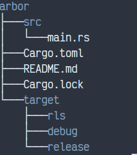

# arbor

A simple replacement for Unix's `tree` command.

Running `arbor` will traverse the directories on your system and print
out a nice tree representation of this hierarchy.



## Features

- Basic Color output (toggleable)
- Unicode tree branches (toggleable)
- Depth control

## Usage

```txt
arbor 0.1.0

USAGE:
    arbor [FLAGS] [OPTIONS] [path]

FLAGS:
    -a, --all         If true, then hidden files will be included in the output
        --ascii       If true, don't use unicode characters for tree branchess
    -h, --help        Prints help information
        --no-color    If true, don't use color when printing
    -V, --version     Prints version information

OPTIONS:
    -d, --depth <depth>    The maximum depth to recurse at. 0 will just print the tree root

ARGS:
    <path>    The path where the tree should begin [default: .]
```
